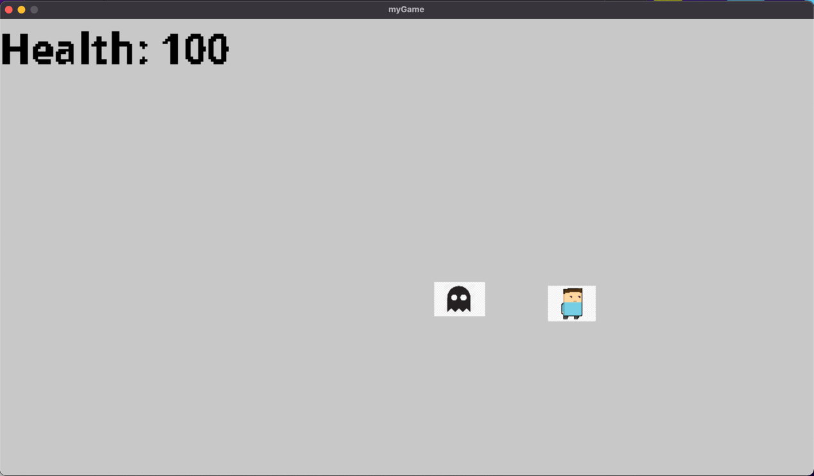

# Enemy AI

---

This is the project from my class - “Game Artificial Intelligence”. In this project, I implement the ***“Steering Forces”*** ( as proposed in [https://www.red3d.com/cwr/steer/](https://www.red3d.com/cwr/steer/)). It can give the NPC enemy an aesthetic behavior of “**tracing the player**”. The goal is to make the game NPC look like a real player in the tracing-and-killing game. 

Without using this algorithm, the game ai CAN trace the player, but in an unnatural way (say running straight forward). The steering force allows the ai to perform “**tracing around**” just like human players. This would make the enemy ai much more REAL.

---

## Intro:

In this game, the player can freely move. But if the player is seen and attacked by the
enemy, he will lose points. There is a sight range for the enemy. If the player is too close
to the enemy, the enemy will see him and start to chase him. There is also an attack
range. If the player is within attack range, the enemy will attack him and then he will lose
points. 

Since my focus of this project is on building enemy AI, this game is more about
how to avoid being attacked by the enemy for the player. I do list some extended goals that can make this game more complete. I will use SDL2 for this project.

 



## How to play:

**To compile:**

```bash
g++ -std=c++14 -o play -I ./include/ -I/Library/Frameworks/SDL2.framework/Headers ./*.cpp -F/Library/Frameworks -framework SDL2 -I/Library/Frameworks/SDL2_image.framework/Headers -F/Library/Frameworks -framework SDL2_image -lSDL2_ttf
```

**To run:**

```bash
./play
```

## Class:

**player:** 

He can freely move around in the scene. The movement is controlled by your mouse.

**enemy**: 

He has 2 states. If the player is far away, he will patrol. If the player is in sight range, he will start to chase.

**score board**:

It shows and updates the player’s health. If the player touches the enemy, he will lose health.

**basic game environment**: 

load some images to represent the player, and the enemy.

## Demo Video:

[https://youtu.be/gcfyqkOlEuU](https://youtu.be/gcfyqkOlEuU)

## **Extended Part:**

- Build a Maze with several enemies inside. The goal of the player will be ‘try to escape and avoid being attacked’. The player cannot freely move now. He will need to find a path to move.
- Add some first-aid kits. If the player was attacked, he can choose to find first-aid kit first. Then he can recover his health points. In this case, I will add more enemies so that it’s necessary for the player to find first-aid kits or he will die.
